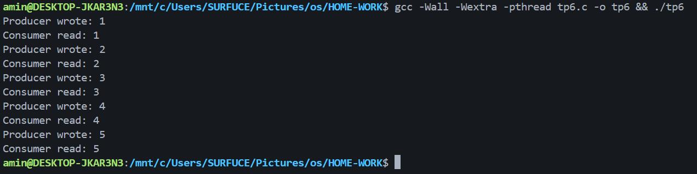

<!-- Badges -->


# `tp6.c` — Producer / Consumer (Monitor)

This folder contains `tp6.c`, a small demonstration of a monitor implemented with semaphores and two condition variables to solve the producer-consumer problem with a single-slot buffer.

Brief behavior:
- Producer writes the integers 1..5 into a buffer of size 1.
- Consumer reads those 5 values.
- Synchronization uses a `Monitor` and two `Condition`s (`cond_prod`, `cond_cons`).

## Build & Run (WSL)
Open WSL in this folder (`HOME-WORK`) and run:

```bash
gcc -Wall -Wextra -pthread tp6.c -o tp6
./tp6
```

Expected output (order preserved):

```
Producer wrote: 1
Consumer read: 1
Producer wrote: 2
Consumer read: 2
...
Producer wrote: 5
Consumer read: 5
```

If you prefer to run from Windows with MinGW, use the same `gcc` command but be aware your MinGW installation may need `pthread` support.

## Result image
Place a `result.png` image in this folder to display here (example output or screenshot):



## Author

- GitHub: [3boudi](https://github.com/3boudi)

---

Replace or extend this README as needed.